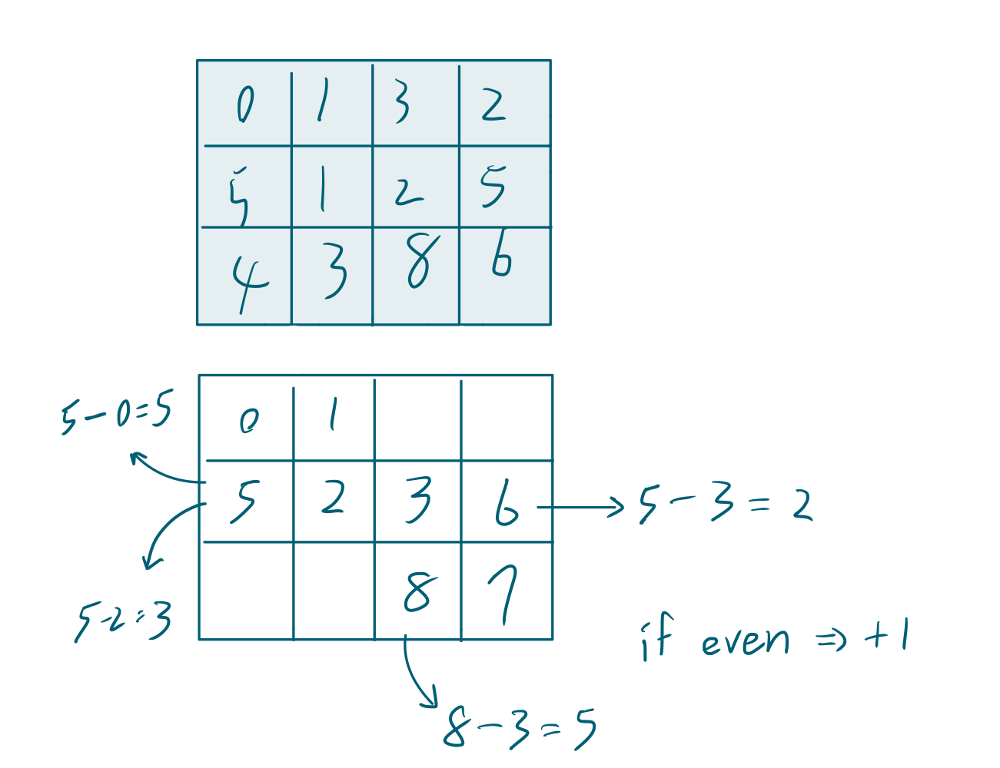

# Minimum Time to Vist a Cell In a Grid
- Difficulty: Hard
- Topics: `Array` `Breadth-First Search` `Graph` `Heap (Priority Queue)` `Matrix` `Shortest Path`

<!-- ## Data Structure
``` cpp
``` -->

## Solution

- runtime beats 45.22% ( but, i'm proud of myself that solved this problem on my own. )
- memory beats 38.01%
``` cpp
class Solution {
private:
public:
    int minimumTime(vector<vector<int>>& grid) {
        if(grid[0][1]>1&&grid[1][0]>1) return -1;
        int n=grid.size(), m=grid[0].size(), dir[5]={-1, 0, 1, 0, -1};
        priority_queue<vector<int>, vector<vector<int>>, greater<vector<int>>> q;
        bool flags[n][m];
        memset(flags, true, sizeof(flags));
        flags[0][0] = false;
        q.push({0, 0, 0});
        while(!q.empty()){
            vector<int> now = q.top();
            q.pop();
            for(int i=0; i<4; ++i){
                int y=now[1]+dir[i], x=now[2]+dir[i+1];
                if(y>=0&&y<n&&x>=0&&x<m&&flags[y][x]){
                    flags[y][x] = false;
                    int offset=((grid[y][x]-now[0])%2==0)?1:0;
                    int next = max(now[0]+1, grid[y][x]+offset);
                    if(y==n-1&&x==m-1) return (next);
                    q.push({next, y, x});
                }
            }
        }
        return -1;
    }
};
```

## Improving
<!-- ... -->
### source code
- runtime beats 
- memory beats 
``` cpp
```