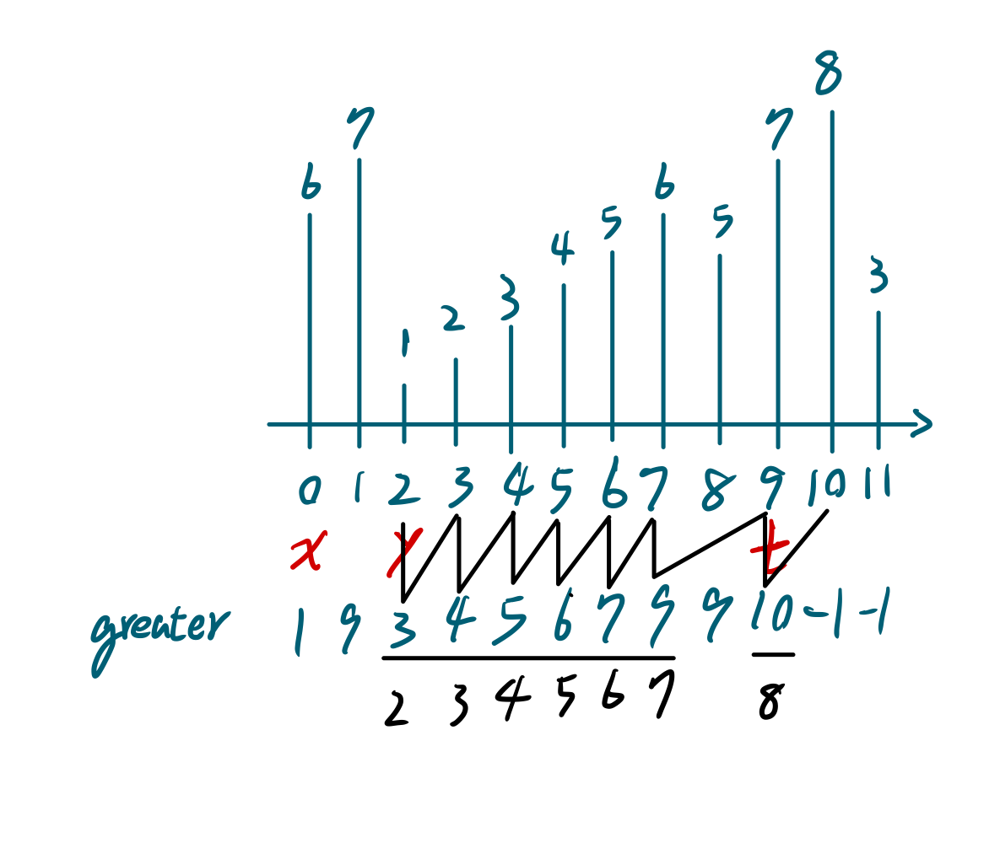

# Find Building Where Alice and Bob Can Meet
- Difficulty: Hard
- Topics: `Array` `Binary Search` `Stack` `Binary Indexed Tree` `Segment Tree` `Heap (Priority Queue)` `Monotonic Stack`

## Solution
solve with hint1~3, I haven't figure out what hint4 means yet.  
> 💡 Hint 4  
> To find index t for each query, sort the queries in descending order of y. Iterate over the queries while maintaining a monotonic stack which we can binary search over to find index t.
- runtime beats 5.10%
- memory beats 93.63%
``` cpp
class Solution {
public:
    vector<int> leftmostBuildingQueries(vector<int>& heights, vector<vector<int>>& queries) {
        int size=heights.size();
        vector<int> gr(size, -1), res;
        stack<pair<int, int>> mono;
        for(int i=0; i<size; ++i){
            if(mono.empty()||mono.top().first>heights[i]) mono.push({heights[i], i});
            else{
                while(!mono.empty()&&mono.top().first<heights[i]){
                    gr[mono.top().second]=i;
                    mono.pop();
                }
                mono.push({heights[i], i});
            }
        }
        for(const vector<int> &query:queries){
            int x=min(query[0], query[1]), y=max(query[0], query[1]);
            if(x==y||heights[x]<heights[y]) res.push_back(y);
            else{
                int t=gr[x];
                if(t!=-1&&t<y){
                    while(y!=-1&&heights[y]<=heights[x]) y=gr[y]; //here💀
                    t=y;
                }
                res.push_back(t);
            }
        }
        return res;
    }
};
```

▲ This is why my runtime so bad. It'll iterate monotonic array every query.

## Improving
using binary search
<!-- ### source code
- runtime beats 
- memory beats 
``` cpp
``` -->