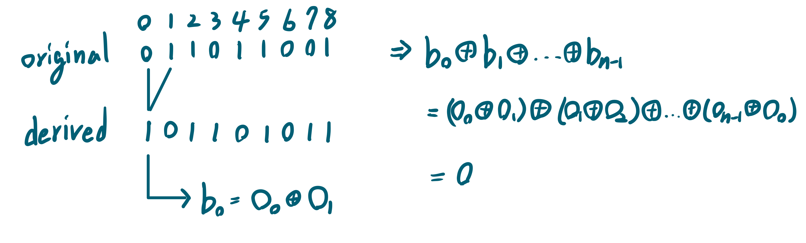

# Neighboring Bitwise XOR
- Difficulty: Medium
- Topics: `Array` `Bit Manipulation`

## Solution

- runtime beats 100.00%
- memory beats 90.19%
``` cpp
class Solution {
public:
    bool doesValidArrayExist(vector<int>& derived) {
        bool res=false;
        for(int &d:derived) res^=d;
        return !res;
    }
};
```

<!-- ## Improving
### source code
- runtime beats 
- memory beats 
``` cpp
``` -->